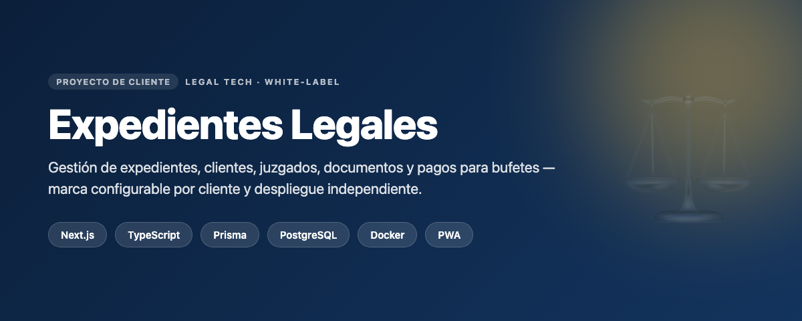
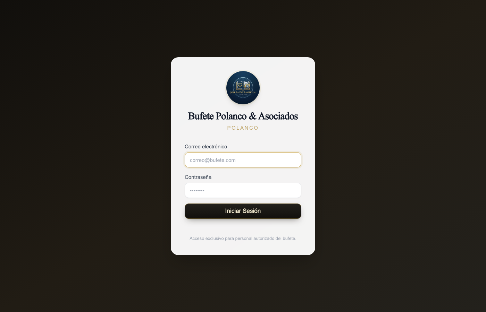
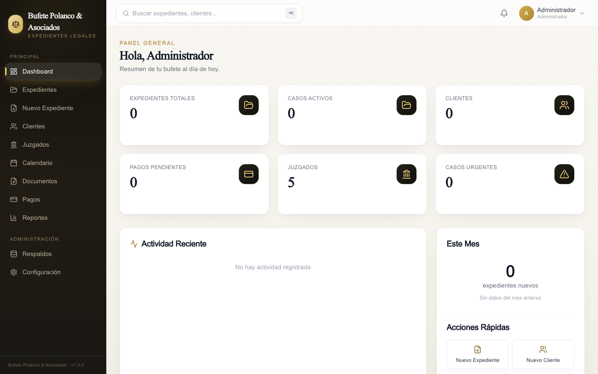
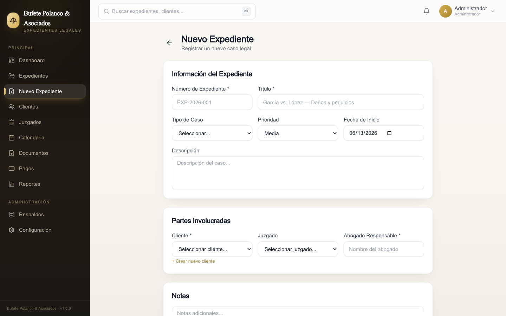
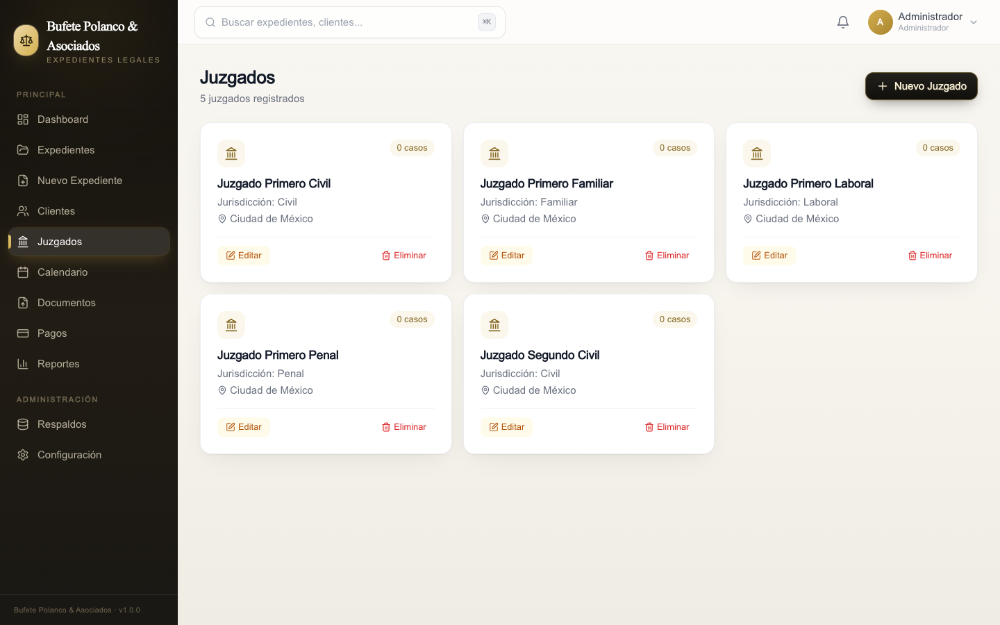

# Expedientes Legales

> Aplicación web para la gestión de expedientes legales en bufetes: clientes, juzgados, documentos, pagos y seguimiento de casos. Diseñada **white-label** para desplegarse por cliente con su propia marca.

---

## Qué es

Sistema de gestión de expedientes legales para abogados y bufetes. Centraliza casos, clientes, juzgados, documentos y pagos en una sola plataforma, con seguimiento del estado de cada expediente. Pensado para entregarse a múltiples clientes: la marca (nombre, subtítulo, ubicación, ícono PWA) es configurable por despliegue.

## Funcionalidades

- **Gestión de expedientes** con clientes, juzgados, documentos y seguimiento de casos.
- **Registro de pagos** asociados a cada expediente.
- **Generación de documentos / PDFs** y vista previa de archivos Word.
- **Autenticación de usuarios** y perfiles.
- **Marca configurable (white-label)** vía variables de entorno: login, manifest PWA y PDFs.
- **PWA instalable** en Windows del abogado, con backend siempre disponible en VPS.

## Stack tecnológico

| Capa | Tecnologías |
|------|-------------|
| Frontend | Next.js, React, TypeScript, Tailwind, Radix UI |
| Backend | Next.js (API routes), Prisma ORM |
| Base de datos | PostgreSQL |
| Documentos | jsPDF, jspdf-autotable, docx-preview |
| Datos / tablas | TanStack Table |
| Infraestructura | Docker + docker-compose (app + PostgreSQL + nginx HTTPS), VPS |

## Mi rol

Diseño y desarrollo **full-stack**: modelo de datos (Prisma), backend, interfaz, generación de documentos, arquitectura white-label multi-cliente y despliegue con Docker en VPS con HTTPS.

## Retos y aprendizajes

- **Arquitectura white-label**: una sola base de código que se despliega para distintos bufetes con marca propia inyectada en build-time.
- **Despliegue auto-contenido**: `docker-compose` con migraciones automáticas al iniciar y PostgreSQL no expuesto a internet.
- **Modelo de datos relacional** para expedientes ↔ clientes ↔ juzgados ↔ documentos ↔ pagos.

## Capturas

> _Capturas reales de la aplicación, con marca de ejemplo y datos de demostración (sin datos reales de clientes)._

| Inicio de sesión (white-label) | Dashboard |
|:---:|:---:|
|  |  |

| Nuevo expediente | Juzgados |
|:---:|:---:|
|  |  |

---

### Sobre el código fuente

El código fuente es **privado** por tratarse de software propietario / de cliente con datos sensibles (información legal). Disponible para revisión en entrevista o con acceso de solo lectura bajo solicitud.

### Contacto

**Angelix Vásquez** · Angelixvrobles1234@outlook.com · [GitHub](https://github.com/AngelixVrobles)
